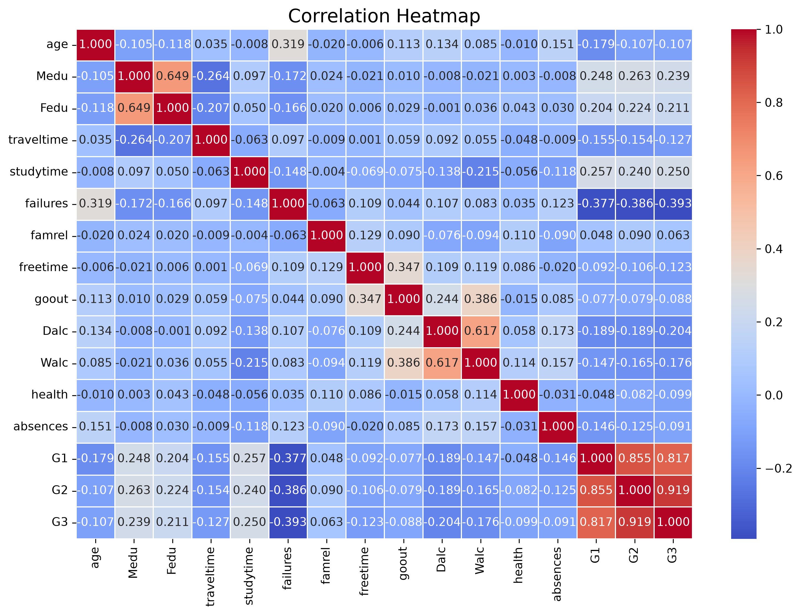
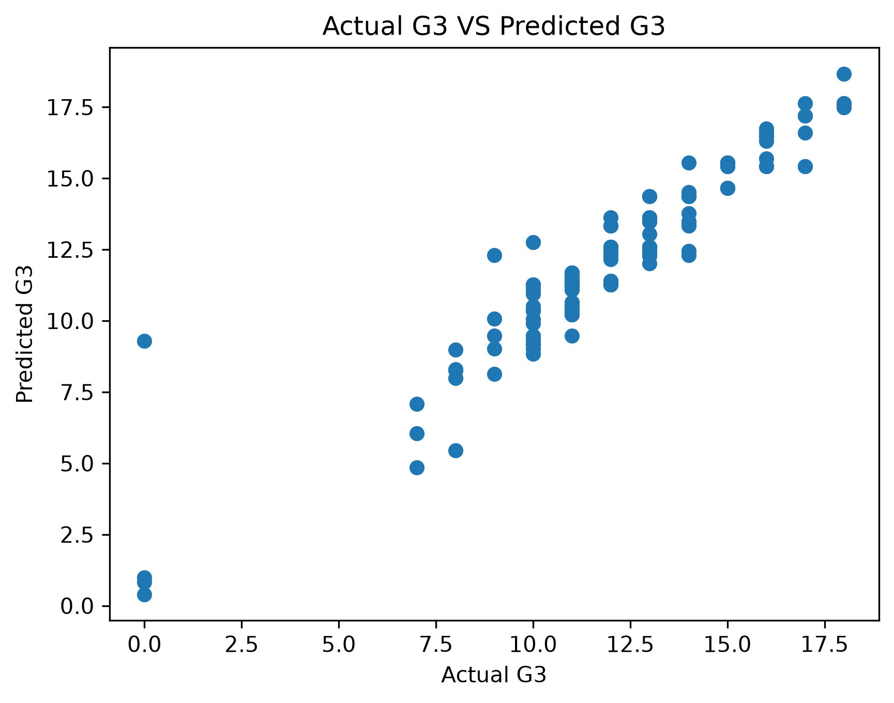
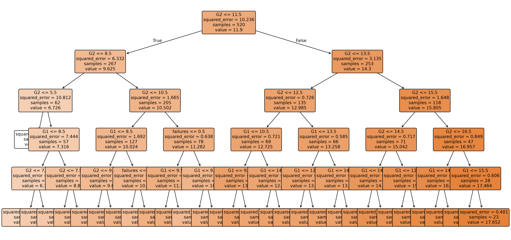
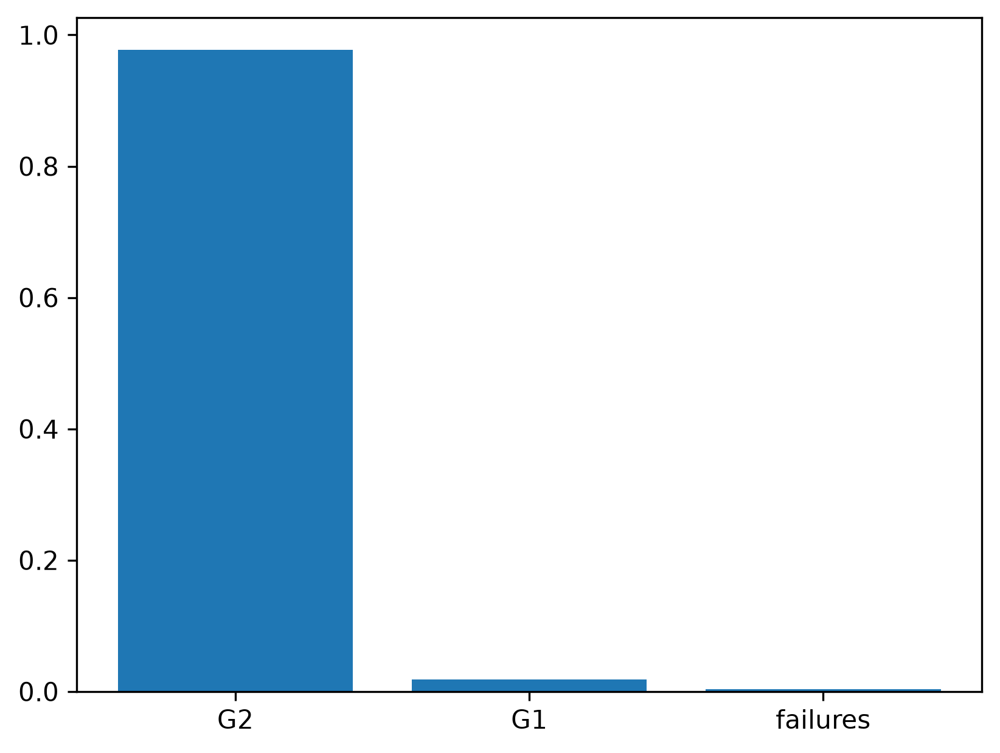

# 🎓 Student Performance Prediction using Machine Learning

A Machine Learning project that predicts students' final grades (**G3**) using academic performance and related student information.

This project follows a complete Machine Learning workflow including **Exploratory Data Analysis (EDA)**, **Feature Selection**, **Model Building**, **Model Evaluation**, **Hyperparameter Tuning**, and **Model Comparison**.

---

# ⭐ Project Highlights

- Complete Exploratory Data Analysis (EDA)
- Correlation Analysis
- Feature Selection
- Linear Regression
- Decision Tree Regression
- Hyperparameter Tuning
- Feature Importance Analysis
- Model Comparison

---

# 📌 Project Overview

The objective of this project is to predict a student's final grade (**G3**) using Machine Learning techniques.

The project begins with Exploratory Data Analysis (EDA) to understand the dataset, identify important relationships between features, and select the most relevant variables for prediction.

Two regression algorithms were implemented and compared:

- Linear Regression
- Decision Tree Regression

After evaluating both models, **Linear Regression achieved the best overall performance** for this dataset.

---

# 🎯 Problem Statement

Educational institutions often need to identify students who may require additional academic support before final examinations.

Predicting student performance at an early stage allows teachers to focus on students who are likely to struggle academically and prepare appropriate learning strategies to improve their performance.

The objective of this project is to build a Machine Learning model capable of predicting students' final grades based on previous academic performance and related factors.

---

# 📊 Dataset Information

- **Dataset Size:** 651 Rows × 33 Columns
- **Target Variable:** G3 (Final Grade)
- **Problem Type:** Regression
- **Missing Values:** None

Several feature combinations were tested during experimentation.

The best-performing Linear Regression model used the following features:

- G2 (Second Period Grade)
- G1 (First Period Grade)
- failures (Number of Previous Class Failures)

Among these features, **G2 proved to be the most influential predictor** of the final grade.

---

# 🔍 Exploratory Data Analysis (EDA)

Before training the models, Exploratory Data Analysis (EDA) was performed to better understand the dataset.

## Key Findings

- The dataset contained **no missing values**, so no missing-value handling was required.
- **G2** showed the strongest positive correlation with the target variable (G3).
- **G1** also showed a strong positive correlation with G3.
- **Failures** showed the strongest negative correlation with the target variable.
- **Absences** had only a weak negative relationship with the final grade.
- The dataset contained very little noise, making it suitable for model training.

---

# 🤖 Machine Learning Models

## 1️⃣ Linear Regression

Linear Regression was selected because the target variable (**G3**) is continuous.

Different feature combinations were tested, and the final model achieved the best performance using:

- G2
- G1
- failures

---

## 2️⃣ Decision Tree Regression

A Decision Tree Regressor was implemented to compare a tree-based algorithm with Linear Regression.

Different values of **max_depth** were tested to reduce overfitting and identify the optimal tree depth.

Although the Decision Tree performed well, Linear Regression achieved better overall results on this dataset.

---

# 📊 Model Evaluation

The models were evaluated using the following metrics:

- Mean Absolute Error (MAE)
- Root Mean Squared Error (RMSE)
- R² Score

## Performance Comparison

| Model | MAE | RMSE | R² Score |
|:---------------------------|------:|------:|------:|
| **Linear Regression** | **0.742** | **1.176** | **0.874** |
| Decision Tree Regression | 0.831 | 1.497 | 0.796 |

The results indicate that **Linear Regression generalized better** than Decision Tree Regression because the relationship between the selected features and the target variable is largely linear.

---

# 🌳 Decision Tree Analysis

To better understand how Decision Trees make predictions, the trained tree was visualized and analyzed.

### Feature Importance

| Feature | Importance |
|:---------|----------:|
| G2 | 97.75% |
| G1 | 1.87% |
| failures | 0.39% |

This confirmed that **G2 was by far the most influential feature** for predicting the final grade.

---

# 🏆 Key Learnings

During this project, I learned:

- Exploratory Data Analysis (EDA)
- Correlation Analysis
- Feature Selection
- Linear Regression
- Decision Tree Regression
- Model Evaluation using MAE, RMSE and R² Score
- Hyperparameter Tuning
- Feature Importance Analysis
- Understanding Overfitting and Generalization
- Comparing Multiple Machine Learning Models

---

# 📷 Project Visualizations

## Correlation Heatmap



---

## Actual vs Predicted Values



---

## Decision Tree Visualization



---

## Feature Importance



---

# 📁 Project Structure

```
Student-Performance-Prediction/

│── datasets/
│   └── student_dataset.csv

│── Images/
│   ├── Correlation_Heatmap.png
│   ├── Actual_vs_predicted_G3.png
│   ├── Decision_Tree.png
│   └── Feature_Importance.png

│── linear_regression.py
│── decision_tree.py
│── requirements.txt
│── README.md
```

---

# 🛠 Technologies Used

- Python
- Pandas
- NumPy
- Matplotlib
- Seaborn
- Scikit-learn

---

# 🚀 Future Improvements

In future versions of this project, I plan to:

- Compare additional regression algorithms such as Random Forest Regression and XGBoost.
- Perform Cross Validation for more reliable model evaluation.
- Apply Hyperparameter Optimization using GridSearchCV.
- Build a web application using Flask or Streamlit.
- Deploy the trained Machine Learning model.

---

# 👨‍💻 Author

**Rohith**

Aspiring Machine Learning Engineer

Currently building practical Machine Learning and Data Analysis projects using Python.

---

# 💡 Reflection

This project represents my first complete end-to-end Machine Learning project.

Rather than focusing only on training a model, I explored the complete Machine Learning workflow—from understanding the dataset and selecting meaningful features to comparing different algorithms and interpreting their results.

The project strengthened my understanding of regression algorithms, model evaluation, feature importance, and the importance of experimentation in Machine Learning.

---

# ⭐ Acknowledgement

This project was developed as part of my Machine Learning learning journey through hands-on practice and experimentation. It helped me build a strong foundation in data analysis, regression algorithms, feature engineering, model evaluation, and problem-solving using Machine Learning.

> **"Machine Learning is not about finding the perfect algorithm; it's about understanding the data, experimenting with different approaches, and choosing the model that best solves the problem."**